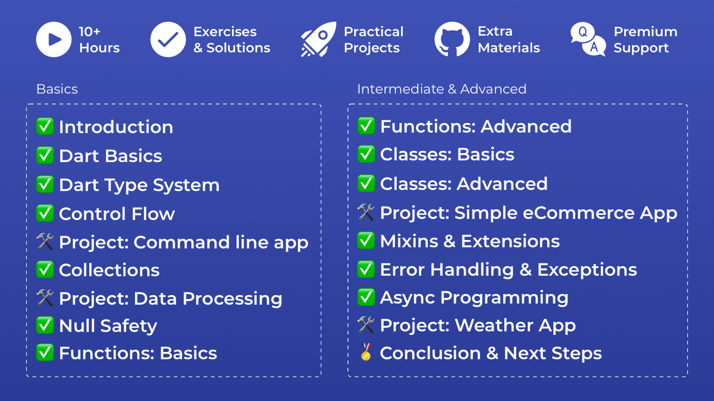

# Dart Course | Code With Andrea

This repo contains all the exercises and solutions from my [Dart Course](https://nnbd.me/dart).

# Course Syllabus

## 1. Introduction

1. Making the most of this course
2. Introduction to Dart
3. Introduction to Dartpad
4. Bonus Content: Dart Complete Reference eBook

## 2. Dart Basics

1. Section Intro
2. The `main` method
3. Hello world
4. Variable declaration and initialization
5. Basic types
6. **Exercise**: printing variables
7. String Concatenation & Interpolation
8. **Exercise**: String interpolation
9. String Escaping
10. Multi-line strings
11. Basic String operations: uppercase and lowercase
12. Initialization vs Assignment
13. **Exercise**: Lowercase and uppercase strings
14. Finding and replacing strings
15. Conversions between types
16. Arithmetic operators
17. **Exercise**: temperature conversion
18. Increment & decrement operators
19. Logical & Relational operators
20. Ternary conditional operator
21. Hex format, bitwise & shifting operators
22. Comments
23. Expressions & statements

## 3. Dart type system

1. Section Intro
2. Static vs Dynamic Languages
3. Type inference with `var`
4. The `final` keyword
5. The `const` keyword
6. **Exercise**: `var`, `final` and `const`
7. The `dynamic` keyword

## 4. Control flow

1. Section Intro
2. If/else statements
3. **Exercise**: if/else statements
4. while loops
5. for loops
6. **Exercise**: fizz buzz
7. `break` and `continue`
8. switch statements
9. enumerations
10. **Exercise**: simple calculator

## 5. Project: Building a command line app

1. Section intro
2. Installing the Dart SDK
3. Installing and configuring VS Code
4. **Project Brief**: Rock, Paper & Scissors
5. Creating a command line app
6. Pseudocode for the game logic
7. Getting use input with stdin from dart:io
8. Implementing the game loop
9. Implementing the game logic

## 6. Collections

1. Section Intro
2. Lists
3. **Exercise**: Sum of the items in a list
4. List methods
5. Type annotations with lists
6. Using `var`, `final`, `const` with lists
7. Sets
8. **Exercise**: Sets
9.  Maps
10. The `as` operator
11. The `null` value
12. Iterating on maps
13. **Exercise**: Pizza Ordering
14. Nested Collections
15. **Exercise**: Restaurant ratings
16. Collection-if
17. Collection-for
18. Spreads
19. **Exercise**: Shopping List
20. Copying collections

## 7. Project: Data Processing in Dart

1. Section Intro
2. Parsing command line arguments
3. Reading files line by line
4. Pseudocode for the processing logic
5. Implementing the processing logic

## 8. Dart Null Safety

1. Introduction to Nullability
2. Nullable and non-nullable variables
3. Flow Analysis: Promotion and Definite Assignment
4. The assertion operator
5. The if-null operator
6. Null Safety with type inference
7. Null Safety with collections
8. The conditional access operator & the billion dollar mistake

## 9. Functions: Basics

1. Section Intro
2. Intro to functions
3. Function arguments
4. Return values
5. **Exercise**: Sum of a list of numbers
6. Named and positional arguments
7. Required and default values
8. Default positional arguments
9. **Exercise**: Pizza ordering with functions
10. Fat arrow notation
11. The global and local scope
12. Inner Functions
13. Global mutable state and functions with side effects

## 10. Functions: Advanced

1. Section Intro
2. Anonymous functions
3. Functions as first class objects
4. Function types
5. Closures
6. The `forEach` method
7. The `map` method
8. `Iterable` and `toList()`
9. Code reuse with anonymous functions and generics
10. The `where` and `firstWhere` methods
11. **Exercise**: Implement the `where` function
12. **Exercise**: Implement the `firstWhere` function
13. The `reduce` method
14. Combining functional operators

## 11. Classes: Basics

1. Section Intro
2. Introduction to classes
3. Instance methods
4. Class constructors and the `this` keyword
5. Initializer lists and the shorthand syntax
6. Classes with immutable members
7. **Exercise**: Creating a `Person` class
8. Type safety with classes
9. `const` constructors
10. Named constructors
11. Named constructors: temperature example
12. Getters and setters
13. **Exercise**: Restaurant ratings with classes
14. Static methods and variables
15. Private variables and methods
16. Wrap up

## 12. Classes: Advanced

1. Section Intro
2. VS Code Dart Setup with Null Safety
3. Introduction to inheritance / subclassing
4. The `super` constructor
5. Overriding methods
6. Abstract classes
7. **Exercise**: Area and Perimeter
8. Interfaces and the difference between `implements` and `extends`
9. The base `Object` class
10. The `toString()` method
11. The equality operator and the `covariant` keyword
12. **Exercise**: Implement the + and * operators
13. Overriding `hashCode` and the Equatable package
14. Using classes with generics
15. Composition vs inheritance: Flutter widget hierarchy example
16. Factory constructors and reading JSON data
17. **Exercise**: JSON Serialization
18. Copying objects with `copyWith`
19. The cascade operator

## 13. Project: Simple eCommerce

1. Simple eCommerce store: Overview
2. Creating the Product, Item, Cart classes
3. Adding the interactive prompt
4. Adding items to the cart
5. Checkout functionality
6. Project structure and wrap-up

## Planned Content

### 14. Mixins & Extensions

1. Section Intro
2. Creating and using mixins
3. Mixins: Drawbacks
4. Extensions
5. Extensions with generic type constraints
6. **Exercise**: Range extension

### 15. Exceptions

### 16. Async Programming

### [LICENSE: MIT](LICENSE)

